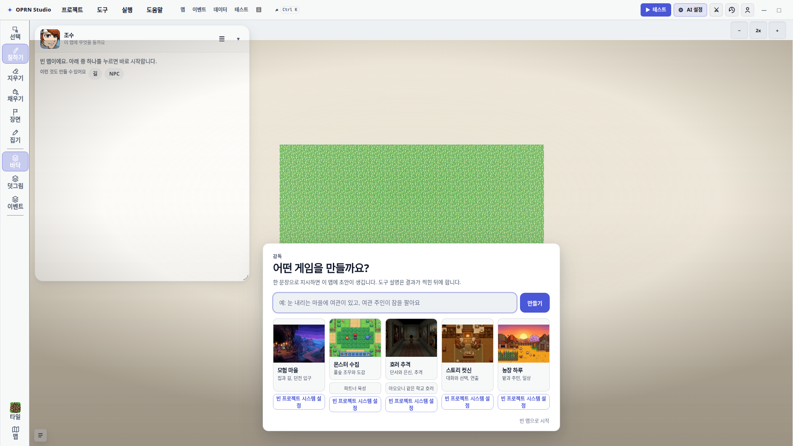
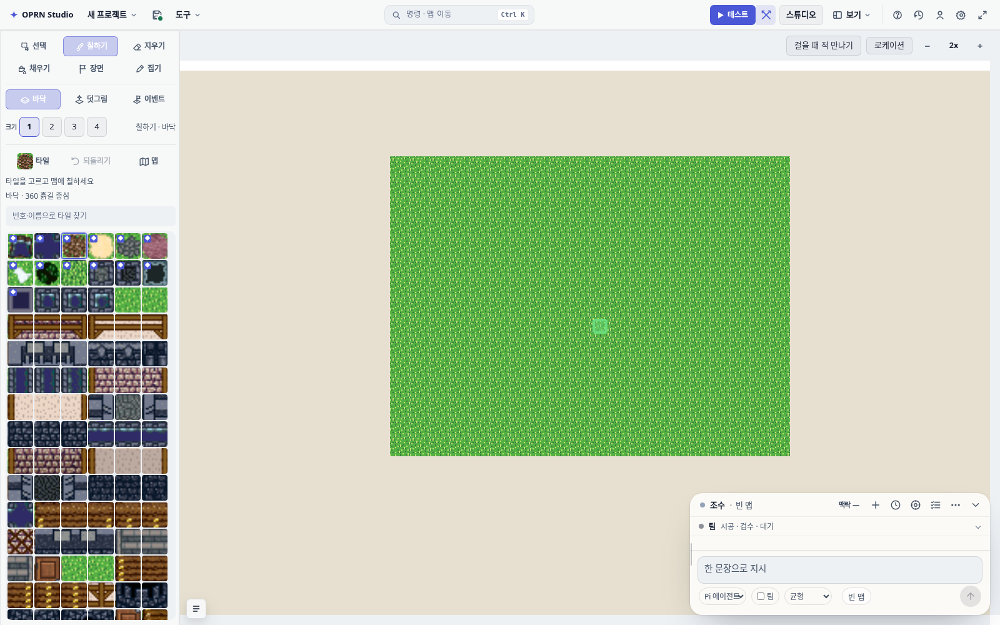

# OPRN Studio

**오픈소스 탑뷰 JRPG 에디터** · 곧 **OpenRPGMaker**

맵을 그리고, 이벤트를 놓고, Play에서 바로 뛰는 웹·데스크톱 게임 메이커를 만들고 있습니다.

지금은 작업 레포 이름이 `rpg-zzu`입니다. 공개 시 **OpenRPGMaker**로 바꾸고, 제품 UI는 **OPRN Studio**로 갑니다.

## 지금 되는 것

| | |
|---|---|
| 맵 | 3레이어 타일 에디터 · 16 / 32 / 48px 칩셋 |
| 데이터 | 액터 · 직업 · 스킬 · 아이템 · 적 · 상태 · 타일셋 |
| 이벤트 | 조사 / 닿음 / 자동 트리거 · 대사 · 분기 · 스위치 · 이동 |
| 전투 | 사이드뷰 ATB |
| AI | 기획 · 맵 · 이벤트를 같이 짜는 어시스턴트 |
| 저장 | 로컬 SQLite 프로젝트 폴더 · Electron 데스크톱 |

  

<i>3레이어 타일 맵 에디터</i>

소스는 아직 비공개입니다. 이름은 바꿀 거고, 에디터는 이미 맵·이벤트·전투·AI까지 한 앱으로 돌아가고 있습니다.

## 같은 방향으로 만든 것들

- [openvnmaker](https://github.com/MovieHolic-Plex/openvnmaker) — 비주얼 노벨 메이커
- [supermariomaker](https://github.com/MovieHolic-Plex/supermariomaker) — 브라우저 SMB1 스타일 코스 메이커
- [chosun-zombie](https://github.com/MovieHolic-Plex/chosun-zombie) — 조선 민속 호러 VN 프롤로그

**만든 사람** · MovieHolic-Plex

